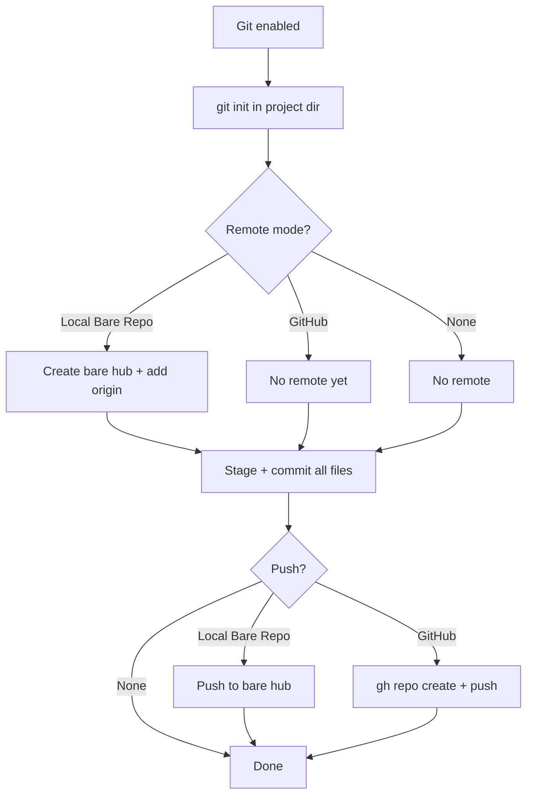

# Git Integration

When **Git Repository** is checked, UV Forger sets up a complete git workflow using a two-phase approach. The exact behaviour depends on the **Git Remote Mode** you choose.

## Git remote modes

UV Forger supports three remote modes, configurable in [Settings](settings.md) and overridable per-build in the Confirm dialog:

| Mode                          | Remote created                        | Push after commit? |
| ----------------------------- | ------------------------------------- | ------------------ |
| **Local Bare Repo** (default) | Bare hub at GitHub Root               | Yes, to hub        |
| **GitHub**                    | GitHub repo via `gh repo create`      | Yes, to GitHub     |
| **None (local only)**         | No remote                             | No                 |



---

## Local Bare Repo (default)

This is the original behaviour. A bare repository on your local filesystem acts as a central hub — like a local GitHub.

### Phase 1: Repository creation

- A local git repo is initialized in the project directory (`git init`)
- A **bare hub repository** is created at your configured GitHub Root path (default: `~/Projects/git-repos/<project_name>.git`)
- The local repo is connected to the hub as the `origin` remote

### Phase 2: Initial commit

- All generated files are staged (`git add .`)
- An initial commit is created
- The commit is pushed to the hub with upstream tracking (`git push -u origin HEAD`)

!!! info "What's a bare hub?"
    A bare repository is a git repo without a working tree — it only contains the `.git` internals. It acts as a central repository that you can push to and pull from. This is useful for keeping a clean backup of your projects on the same machine or a network drive.

---

## GitHub

Creates a repository on GitHub using the [GitHub CLI (`gh`)](https://cli.github.com/).

### Phase 1: Repository creation

- A local git repo is initialized in the project directory (`git init`)
- No bare hub or remote is created yet

### Phase 2: Initial commit + GitHub repo

- All generated files are staged and committed
- `gh repo create` creates a new GitHub repository, adds it as `origin`, and pushes

### Configuration

In Settings, you can configure:

- **GitHub Username / Org** — Prefix for the repo name (e.g., `myorg/my_app`). Leave blank to use your default GitHub account.
- **Create Private Repos** — Whether repos are created as private (default) or public.

These can also be overridden per-build in the Confirm dialog.

### Requirements

GitHub mode requires the `gh` CLI to be installed and authenticated. UV Forger runs pre-flight checks before starting the build:

1. **`gh` installed** — checks that `gh --version` succeeds
2. **`gh` authenticated** — checks that `gh auth status` succeeds

If either check fails, the build is blocked with a clear error message. You can also use the "Check gh status" button in the Settings dialog to verify without starting a build.

To set up `gh`:

```bash
# Install (macOS)
brew install gh

# Authenticate
gh auth login
```

See [cli.github.com](https://cli.github.com/) for installation on other platforms.

---

## None (local only)

Creates a local git repo with an initial commit but no remote. Use this when you want version control without any push target — for example, when you'll add a remote manually later.

### Phase 1: Repository creation

- A local git repo is initialized in the project directory (`git init`)

### Phase 2: Initial commit

- All generated files are staged and committed
- No remote is configured and no push occurs

---

## Configuring the remote mode

### In Settings

Open the overflow menu (**⋮**) → **Settings**. The **Git Remote** section contains:

- **Git Remote Mode** dropdown — Local Bare Repo, GitHub, or None
- **GitHub Username / Org** — for GitHub mode
- **Create Private Repos** checkbox — for GitHub mode
- **Check gh status** button — verifies `gh` is installed and authenticated

### Per-build override

The Confirm Build dialog includes a **Git Remote Mode** dropdown that lets you override the default for a single build. This is useful if you normally use one mode but occasionally want a different one.

## Git default setting

In Settings, you can configure whether the Git checkbox is checked by default for new projects. This saves a click if you always (or never) want git initialization.
