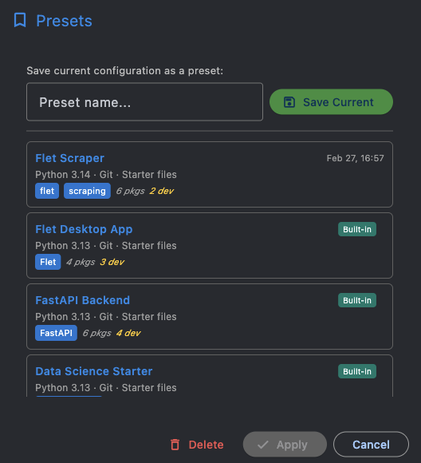

# Presets

Presets let you save a full project configuration as a named template for one-click reuse. Open Presets from the overflow menu (**...**) in the app bar, or use the quick-select dropdown in the main window.

## Built-in presets

UV Forge ships with 4 starter presets so you can build immediately without configuring anything:

| Preset                | Framework / Type | Packages                                         |
| --------------------- | ---------------- | ------------------------------------------------ |
| **Flet Desktop App**  | Flet (UI)        | flet + pytest, ruff (dev)                        |
| **FastAPI Backend**   | FastAPI          | fastapi, uvicorn + pytest, ruff, httpx (dev)     |
| **Data Science Starter** | Data Analysis | pandas, numpy, matplotlib, jupyter               |
| **CLI Tool (Typer)**  | CLI (Typer)      | typer[all] + pytest, ruff (dev)                  |

Built-in presets use Python 3.13, git enabled, starter files enabled, and MIT license. They appear with a teal **Built-in** badge and cannot be deleted.

## Saving a preset

1. Configure your project the way you want it
2. Open the Presets dialog
3. Enter a name and click **Save Current**

This captures everything: Python version, git and starter file settings, UI framework, project type, folder structure, all packages (including dev), and project metadata.

Saving with an existing name overwrites the previous preset. There's no limit on user presets.

## Applying a preset

**From the Presets dialog:** Click a preset to select it, then click **Apply**.

**From the quick-select dropdown:** The dropdown in the main window (below Python version) lists all presets. Selecting one applies it immediately.

Applying a preset populates all configuration fields but leaves your project name and path unchanged, so you can reuse the same stack across different projects.

!!! note
    Any post-build packages from Settings (e.g., `pre-commit`) are automatically merged in when applying a preset.

## Deleting a preset

Select a preset in the dialog and click **Delete**. The dialog stays open so you can continue managing presets. Built-in presets cannot be deleted. If you save a user preset with the same name as a built-in, the user preset takes priority.
