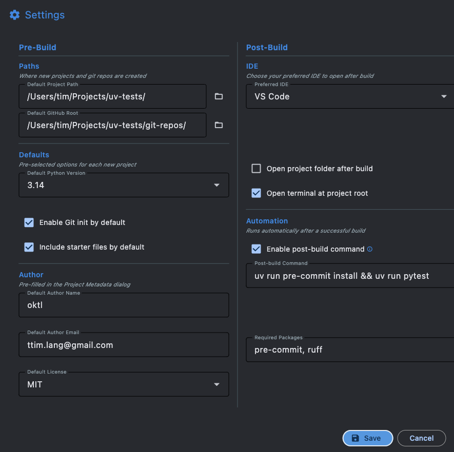
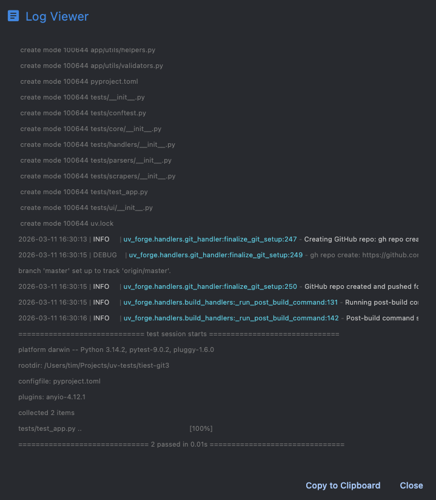

# Settings

Open Settings from the overflow menu (**...**) in the app bar. All settings are saved automatically and persist across sessions.

## Options

| Setting                  | Description                                                      | Default                    |
| ------------------------ | ---------------------------------------------------------------- | -------------------------- |
| **Default Project Path** | Directory where new projects are created                        | `~/Projects`               |
| **GitHub Root**          | Location for bare hub repositories                               | `~/Projects/git-repos`     |
| **Python Version**       | Default Python version for new projects                          | `3.14`                     |
| **Preferred IDE**        | IDE used for "Open in IDE" after build                           | VS Code                   |
| **Git Default**          | Whether the Git checkbox is checked by default                   | Off                        |
| **Git Remote Mode**      | How the remote is set up: Local Bare Repo, GitHub, or None       | Local Bare Repo            |
| **GitHub Username / Org** | Username or organisation for GitHub repo creation               | —                          |
| **Create Private Repos** | Whether GitHub repos are created as private or public            | On (private)               |
| **Default Author Name**  | Pre-filled in the Project Metadata dialog                       | —                          |
| **Default Author Email** | Pre-filled in the Project Metadata dialog                       | —                          |
| **Post-build Command**   | Shell command to run after each successful build                 | —                          |
| **Enable Post-build**    | Whether the post-build command runs by default                   | Off                        |
| **Post-build Packages**  | Packages required by the post-build command (comma-separated)    | —                          |

## Storage location

Settings are stored as JSON in the platform-appropriate user data directory:

| Platform | Path                                              |
| -------- | ------------------------------------------------- |
| macOS    | `~/Library/Application Support/UV Forge/`         |
| Linux    | `~/.local/share/UV Forge/`                        |
| Windows  | `%LOCALAPPDATA%/UV Forge/`                        |

Three files are stored here:

| File                   | Contents                                             |
| ---------------------- | ---------------------------------------------------- |
| `settings.json`        | All configurable defaults                            |
| `recent_projects.json` | Last 5 successful builds                             |
| `presets.json`         | Named project configuration presets                  |

Log files rotate daily in a `logs/` subdirectory alongside these files.

### Log viewer

The log viewer (accessible from the overflow menu) shows colour-coded log entries with clickable source locations that open directly in your IDE.

## Project metadata

The **Project Metadata...** button in the main window opens a dialog for:

- **Author name** and **email** — default from settings, persist across resets
- **Description** — one-line project summary
- **License** — SPDX license identifier (e.g., MIT, Apache-2.0)

These values are written into `pyproject.toml` during the build. A summary line (e.g., "Tim Lang | MIT") appears next to the button so you can see what's configured without opening the dialog.
