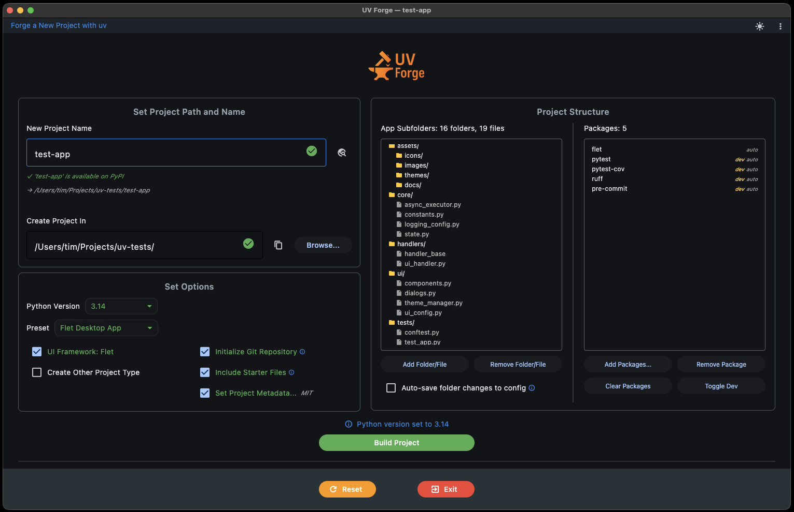

# UV Forge

**Forge Python projects in seconds — not minutes.**

UV Forge is a desktop app that scaffolds production-ready Python projects using the [uv](https://docs.astral.sh/uv/) package manager. Pick a UI framework, project type, or both — UV Forge generates the folder structure, boilerplate files, packages, virtual environment, git repo, and `pyproject.toml` in one click.

{ .img-lg }

---

## Why UV Forge?

Setting up a new Python project means repeating the same steps every time: create directories, write boilerplate, configure `pyproject.toml`, set up git, install packages. UV Forge handles all of that so you can start writing actual code immediately.

- **10 UI frameworks** — Flet, PyQt6, PySide6, tkinter, customtkinter, Kivy, Pygame, NiceGUI, Streamlit, Gradio
- **21 project types** — Django, FastAPI, Flask, data science, ML, CLI tools, REST/GraphQL/gRPC APIs, web scraping, and more
- **Template merging** — Select both a UI framework *and* a project type; their folder structures merge intelligently
- **Smart scaffolding** — Key files come pre-populated with starter code, not empty
- **File editor** — Preview, edit, and import file content before building with a full-featured code editor
- **User templates** — Save custom boilerplate that persists across sessions and overrides built-in content
- **PyPI name checker** — Verify your package name is available before you build
- **Git integration** — Two-phase setup with local hub, GitHub, or no-remote options; commits and pushes automatically
- **Presets** — Save full configurations for one-click reuse; ships with 4 built-in starters
- **Post-build automation** — Run shell commands (e.g., `uv run pre-commit install`) after every build
- **Rollback on failure** — If a build fails partway through, partial files are cleaned up automatically

---

## Quick links

- :material-download: **[Installation](installation.md)** — Get UV Forge running
- :material-rocket-launch: **[Quick Start](quickstart.md)** — Build your first project
- :material-file-tree: **[Templates](guide/templates.md)** — How the template system works
- :material-cog: **[Settings](guide/settings.md)** — Configure defaults and preferences
- :material-keyboard: **[Keyboard Shortcuts](reference/keyboard-shortcuts.md)** — Speed up your workflow

