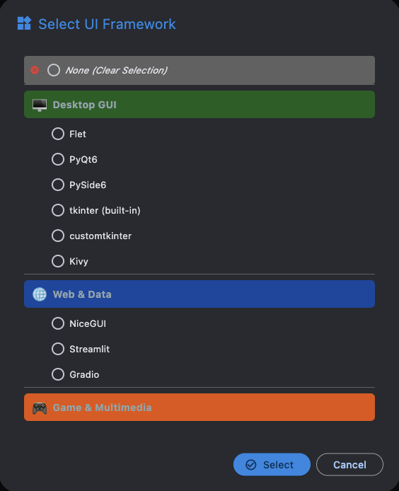
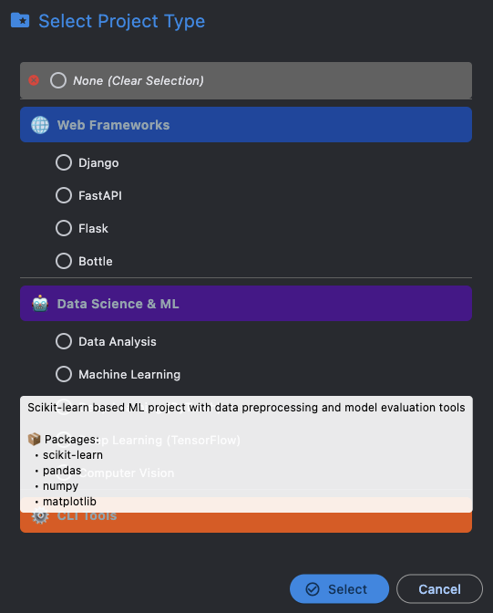
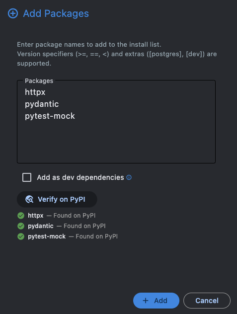
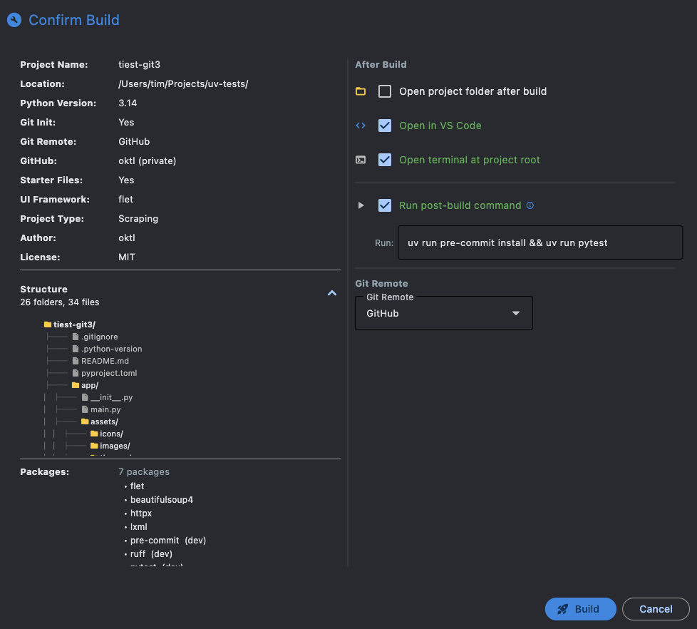

# Quick Start

This walkthrough creates a project from scratch in under a minute.

## 1. Enter a project name

Type a valid Python package name — letters, numbers, and underscores. UV Forge validates as you type, showing a green checkmark when the name is valid.

A live path preview appears below the field showing the full resolved project path.

!!! note
    Click the globe icon next to the name field to check if the name is available on PyPI. Green = available, red = taken, orange = couldn't reach PyPI.

## 2. Set the project path

Browse or type the directory where your project folder will be created. The default is pre-filled from your [settings](guide/settings.md).

## 3. Choose a Python version

Select from Python 3.10 through 3.14 using the dropdown. The version is written into `.python-version` and `pyproject.toml`.

## 4. Optional: Enable Git

Check **Git Repository** to get a fully initialized git repo with an automatic first commit. You can choose the remote mode — local bare hub (default), GitHub, or no remote — in [Settings](guide/settings.md). See [Git Integration](guide/git-integration.md) for details on the two-phase setup and each mode.

## 5. Optional: Select a UI framework and/or project type

- Check **UI Project** to pick from 10 UI frameworks

{ .img-sm }

- Check **Project Type** to pick from 21 project types

{ .img-sm }

- You can select **both** — their templates are [merged intelligently](guide/templates.md#template-merging)

Each selection auto-loads a folder structure and package list. You can customize both before building.

## 6. Review and customize

The **Folders & Files** section shows what will be created. You can:

- **Add** custom folders or files at any level — when adding a file, click **Browse...** to import an existing file from disk in one step
- **Remove** items you don't need
- **Edit file content** — Right-click any file to preview, edit, or import content before building
- **Edit File button** — Select a file and click the pencil icon in the toolbar for quick editing
- Packages are listed separately and can be added, removed, or marked as dev dependencies

<!-- TODO: screenshot of file context menu -->
<!-- { .img-sm } -->

Files with custom content show a **✎** pencil indicator in the folder tree. Edits are preserved across template reloads.

{ .img-sm }

!!! tip
    Right-click a file and choose **Edit Content...** to open the full-screen code editor with syntax highlighting, search & replace, and more. See [Templates — File Content Editing](guide/templates.md#file-content-editing) for details.

## 7. Build

Click **Build Project** (or press ++cmd+enter++ / ++ctrl+enter++). A confirmation dialog shows a summary of your project, including a collapsible tree preview.

{ .img-lg }

Choose your post-build actions:

- Open project folder
- Open in your preferred IDE
- Open a terminal at the project root
- Run a [post-build command](guide/post-build.md)

Click **Confirm** and watch the progress bar track each build step in real time.

---

## What gets created

For a project called `my_app` with Flet selected and git enabled, you'd get:

```
my_app/
├── .git/
├── .gitignore
├── .python-version
├── pyproject.toml
├── README.md
├── app/
│   ├── __init__.py
│   ├── main.py          ← starter code, not empty
│   ├── state.py          ← starter code
│   ├── components.py     ← starter code
│   └── core/
│       ├── __init__.py
│       ├── constants.py  ← starter code
│       └── models.py
├── tests/
│   └── __init__.py
└── .venv/
```

All starter files have `{{project_name}}` replaced with a formatted version of your project name (e.g., `my_app` becomes `My App` in titles and docstrings).
