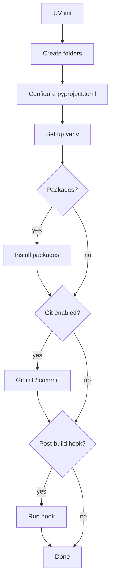
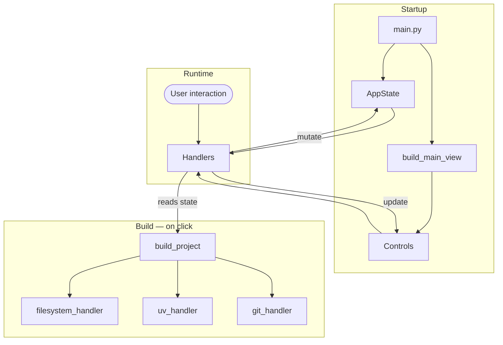

# Architecture

This page is a map of the UV Forge codebase for contributors.
It covers module responsibilities, key patterns, and how data flows through the app.

---

## Module Map

### core/

Core logic with no UI dependencies.

| Module                  | Role                                                  |
| ----------------------- | ----------------------------------------------------- |
| **`constants.py`**      | Single source of truth: versions, frameworks, package maps, paths |
| **`state.py`**          | `AppState` dataclass — all mutable state              |
| **`models.py`**         | Data models: `FolderSpec`, `ProjectConfig`, `BuildResult` |
| **`validator.py`**      | Project name, folder name, and path validation        |
| **`template_loader.py`**| JSON template loading with fallback chain             |
| **`template_merger.py`**| Merges framework + project type templates recursively |
| **`boilerplate_resolver.py`** | Populates created files with starter content    |
| **`pypi_checker.py`**   | Async PyPI name availability check (`httpx`, PEP 503) |
| **`async_executor.py`** | `ThreadPoolExecutor` wrapper for subprocess calls     |
| **`settings_manager.py`** | `AppSettings` load/save to platformdirs JSON        |
| **`history_manager.py`**  | Recent projects history (capped at 5)               |
| **`preset_manager.py`**   | Named configuration presets (user + built-in)       |
| **`logging_config.py`**   | Loguru setup: console + file handlers with rotation |

### handlers/

Event handling and build orchestration. All handlers receive `(page, controls, state)`.

| Module                   | Role                                                 |
| ------------------------ | ---------------------------------------------------- |
| **`ui_handler.py`**      | `Handlers` class (mixin composition) + `attach_handlers()` wiring |
| **`handler_base.py`**    | `HandlerBase` mixin — shared helpers (snackbar, status, validation) |
| **`input_handlers.py`**  | Path and name input handlers                         |
| **`option_handlers.py`** | Checkboxes, dialogs, template loading/merging        |
| **`folder_handlers.py`** | Folder tree display and management                   |
| **`package_handlers.py`**| Package list display, dev toggles                    |
| **`build_handlers.py`**  | Build, reset, exit, keyboard shortcuts, history restore, preset apply |
| **`feature_handlers.py`**| Theme toggle, help, about, settings, log viewer, history, presets |
| **`project_builder.py`** | `build_project()` orchestration — UV init → git → folders → packages |
| **`filesystem_handler.py`** | Folder creation, `cleanup_on_error()` rollback    |
| **`uv_handler.py`**      | `run_uv_init()`, `install_package()`, `setup_virtual_env()` |
| **`git_handler.py`**     | Two-phase git setup: init → commit/push              |

### ui/

Flet controls, dialogs, and theming.

| Module                | Role                                                    |
| --------------------- | ------------------------------------------------------- |
| **`components.py`**   | `Controls` class + `build_main_view()` — appbar overflow menu |
| **`dialogs.py`**      | App-specific dialogs: confirm, settings, build summary, history, presets |
| **`content_dialogs.py`** | Reusable content dialogs: help, about, file edit, preview |
| **`dialog_data.py`**  | Framework/project type categories — dialog display metadata |
| **`custom_dropdown.py`** | `CustomDropdown` — animated overlay dropdown (Python version, presets) |
| **`tree_builder.py`** | Project tree builder: plain-text + styled Flet controls |
| **`theme_manager.py`**| `get_theme_colors()` singleton                          |
| **`ui_config.py`**    | UI constants (colours, sizes)                           |

---

## Key Patterns

### Handler Mixin Composition

The `Handlers` class in `ui_handler.py` composes six mixins (`InputHandlers`, `OptionHandlers`, `FolderHandlers`, `PackageHandlers`, `BuildHandlers`, `FeatureHandlers`), all inheriting from `HandlerBase` for shared helpers like `show_snackbar()` and `set_status()`. The standalone `attach_handlers()` function wires handler methods to UI control callbacks.

### Async in Flet

Flet 0.80+ uses sync callbacks, so async coroutines must be wrapped:

```python
def wrap_async(coro_func):
    def wrapper(e):
        asyncio.create_task(coro_func(e))
    return wrapper

controls.some_button.on_click = wrap_async(handler.on_some_click)
```

Use `AsyncExecutor.run()` to offload subprocess calls (UV, git) to a thread pool, keeping the UI responsive. `CustomDropdown` callbacks are an exception — they receive a plain `str` and are wired directly without `wrap_async`.

### Template Loading Chain

Templates load through a 3-step fallback:

1. Framework-specific template (e.g., `ui_frameworks/flet.json`)
2. `ui_frameworks/default.json`
3. Hardcoded `DEFAULT_FOLDERS` in `constants.py`

When both a UI framework and project type are selected, both templates are loaded and merged via `merge_folder_lists()` — folders matched by name are merged recursively, unmatched folders are included from both sides. The single entry point for all template loading is `_reload_and_merge_templates()` in `option_handlers.py`.

### Build Pipeline

`build_project()` in `project_builder.py` orchestrates the full build sequence. Total steps are computed dynamically based on config, and an `on_progress` callback drives the determinate progress bar. On failure, `cleanup_on_error()` removes the partial project directory.



---

## Data Flow



`AppState` is created at startup and passed to both `build_main_view()` and `Handlers()`. User interactions trigger handler methods that mutate state and update controls. On build, `build_project()` reads the current state and delegates to the filesystem, UV, and git handlers.

---

## Adding New Features

!!! tip "Contributor checklist"

    - **New framework or project type** — Add to `constants.py`, create a template JSON, add to `dialog_data.py`. See [Adding a new template](../guide/templates.md#adding-a-new-template).
    - **New boilerplate** — Drop a file into `config/templates/boilerplate/` under the right subdirectory. No code changes needed.
    - **New handler** — Add a method to the appropriate mixin, wire it in `attach_handlers()`.
    - **New setting** — Add a field to `AppSettings` in `settings_manager.py`, add a row to the settings dialog in `dialogs.py`.
    - **New dialog** — Add to `dialogs.py` (app-specific) or `content_dialogs.py` (reusable content). Wire via a menu item in `components.py` and a handler in `feature_handlers.py`.
