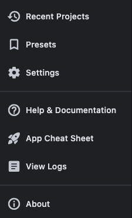

# Keyboard Shortcuts

| Shortcut                  | Action                                  |
| ------------------------- | --------------------------------------- |
| ++cmd+enter++ / ++ctrl+enter++ | Build project (when inputs are valid)  |
| ++cmd+f++ / ++ctrl+f++       | Open Add Folder/File dialog             |
| ++cmd+p++ / ++ctrl+p++       | Open Add Packages dialog                |
| ++cmd+s++ / ++ctrl+s++       | Save as Preset (when config is modified)|
| ++cmd+r++ / ++ctrl+r++       | Reset all fields (shows confirmation)   |
| ++cmd+slash++ / ++ctrl+slash++ | Open Help dialog                      |
| ++escape++                   | Close current dialog / Exit application |

## File editor

When the full-screen file editor is open, these shortcuts are available:

| Shortcut                  | Action                     |
| ------------------------- | -------------------------- |
| ++cmd+f++ / ++ctrl+f++       | Search                     |
| ++cmd+alt+f++ / ++ctrl+alt+f++ | Search & Replace          |
| ++cmd+s++ / ++ctrl+s++       | Save to user templates     |
| ++cmd+shift+s++ / ++ctrl+shift+s++ | Save As              |
| ++cmd+d++ / ++ctrl+d++       | Toggle diff pane           |
| ++cmd+g++ / ++ctrl+g++       | Go to line                 |
| ++cmd+l++ / ++ctrl+l++       | Toggle read-only           |
| ++cmd+shift+p++ / ++ctrl+shift+p++ | Command palette      |
| ++cmd+shift+l++ / ++ctrl+shift+l++ | Change language       |
| ++cmd+plus++ / ++ctrl+plus++ | Zoom in (font size)        |
| ++cmd+minus++ / ++ctrl+minus++ | Zoom out (font size)     |
| ++f1++                       | Help                       |
| ++escape++                   | Close search bar or editor |

## Overflow menu

All secondary actions are in the app bar overflow menu (**...**):

{ .img-sm }

| Action              | Description                                         |
| ------------------- | --------------------------------------------------- |
| **Recent Projects** | Restore a previous build's full configuration       |
| **Presets**         | Save, apply, and delete named configurations        |
| **Settings**        | Configure defaults and post-build behaviour         |
| **Help**            | Usage guide and keyboard shortcuts                  |
| **App Cheat Sheet** | Quick reference card                                |
| **View Logs**       | Colour-coded log viewer with clickable source locations |
| **About**           | App info and tech stack                             |
